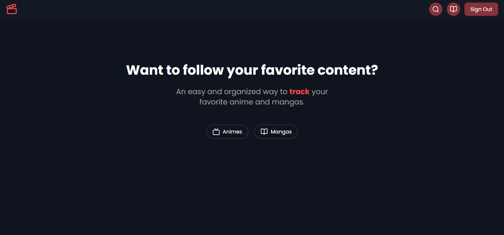
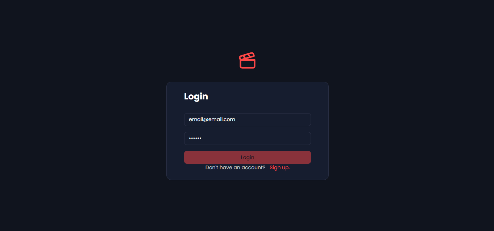
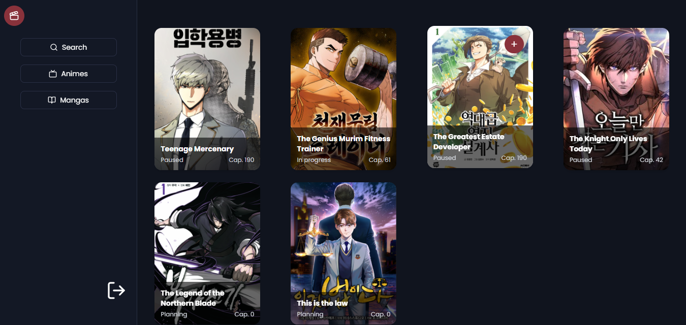
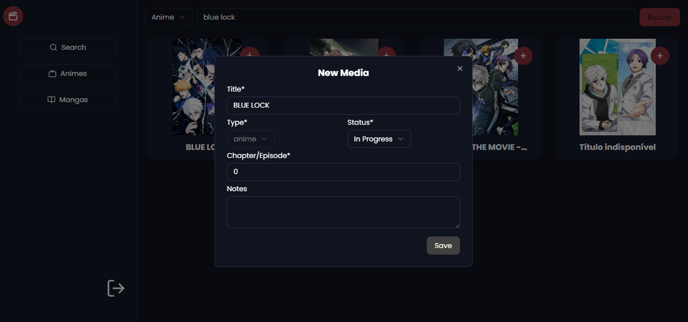

# 
📺 Media Tracker

Um site para acompanhar seu progresso em animes e mangás favoritos de forma organizada, moderna e responsiva.

> ⚠️ **Este projeto ainda está em desenvolvimento.**

## 🌐 Acesse o site
O site está disponível no seguinte link:  **[media-tracker](https://media-tracker-inky.vercel.app/)**

> ℹ️ Este projeto utiliza APIs públicas (como Anilist) e serviços com planos gratuitos (como Supabase), o que pode ocasionar **limitações de uso** ou **restrições temporárias**.

## 🚀 Tecnologias Utilizadas

Este projeto utiliza as seguintes tecnologias e ferramentas:

- [Next.js](https://nextjs.org/)
- [Tailwind CSS](https://tailwindcss.com/)
- [ShadCN/UI](https://ui.shadcn.dev/)
- [Supabase](https://supabase.com/)
- [Lucide Icons](https://lucide.dev/)
- [TypeScript](https://www.typescriptlang.org/)

## 🧩 Funcionalidades Planejadas

- 📌 Listagem das mídias salvas
- 🏷️ Filtros por tipo (animes e mangás)
- 🔍 Busca de conteúdos via [Anilist API](https://docs.anilist.co/)
- 📊 Acompanhamento de progresso (episódios e capítulos)
- 📝 Adição, edição e exclusão de mídias
- 👤 Cadastro de usuários com confirmação de e-mail
- 🔐 Autenticação de usuários

---

## 
🖼️ Imagens do Projeto

  
<b>Home</b>

  

  
<b>Login</b>

  

  
<b>Media</b>

  

  
<b>Search</b>

  

